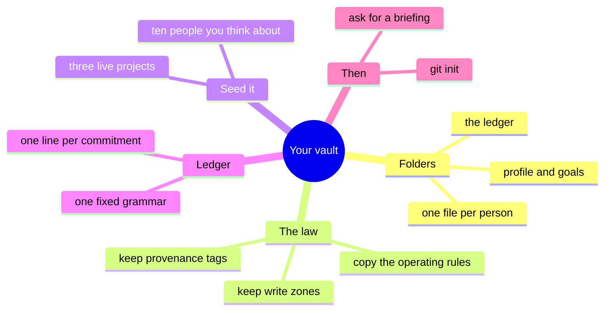
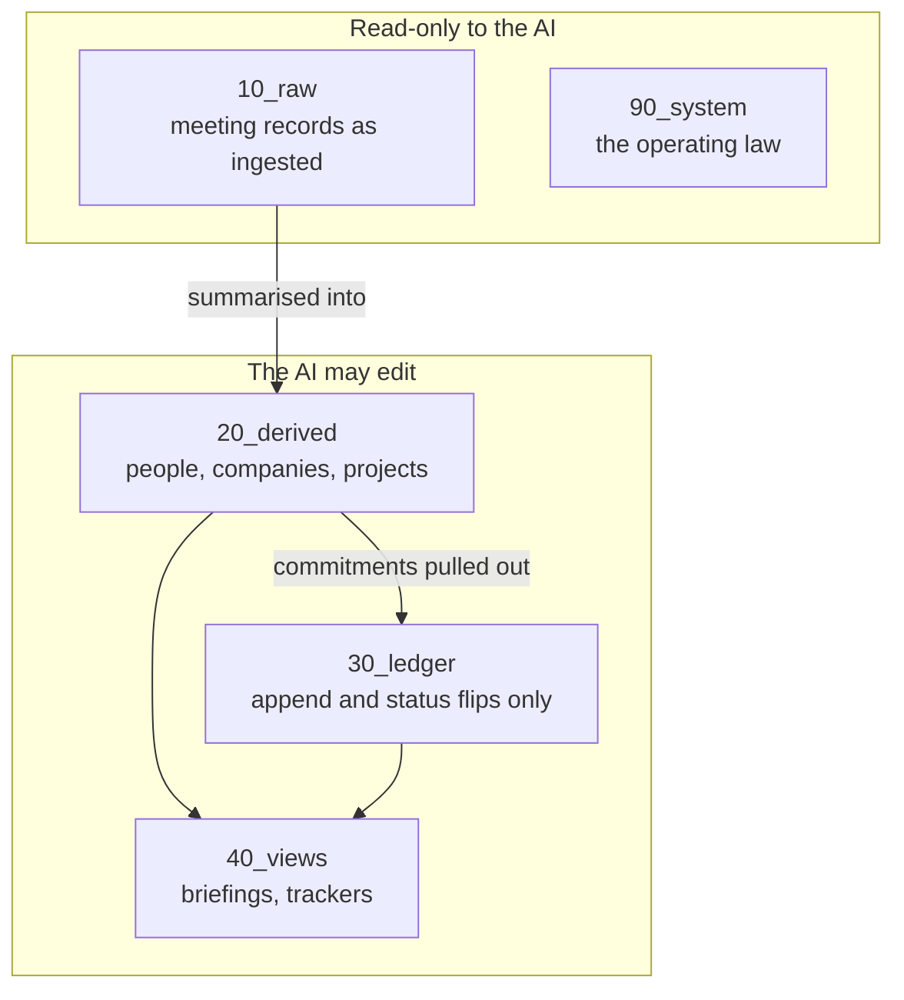

# Build your own

This isn't a product and there's nothing to install. It's a folder layout and a set of rules. If you want to run something like it, here's the short version. You need a folder, git, and an AI agent that can read and write files (I use Claude Code).

You don't need to write code.

## The first 30 minutes

1. Make the folders. Use the layout in [OPERATING_RULES.md](OPERATING_RULES.md).
2. Copy [OPERATING_RULES.md](OPERATING_RULES.md) into your vault as the instruction file your agent reads at the start of every session. Replace the operator references with you. Keep the rules on the first pass. You can loosen them later, but each one you drop is a failure you're re-enabling. Keep the provenance tags, the gap rule, the conflict rule and the write zones at minimum.
3. Write half a page about yourself, and your current goals, in `00_index/`.
4. Seed `20_derived/` with the ten people and three projects you actually think about. Use the [templates](../templates/). Thin pages are fine. Marking something as unknown is fine.
5. Start the ledger. One line per commitment, in the grammar. This is the highest-value file in the system and the one people skip.
6. `git init`, first commit.

Then open a session and ask for a morning briefing.

## The part people get wrong

Write zones. The AI may edit some folders and not others, and the arrows only run one way: the layer that summarises can never edit the layer it summarises from.

Get this wrong and the AI will eventually "tidy" a raw record so it matches its own summary. Then the source and the summary agree, and both are wrong, and you have no way to tell.

## What to expect in the first fortnight

The AI will want to state its guesses as facts. The provenance tags make that visible. Correct it early and it sticks.

You'll be tempted to skip the ledger grammar and just write commitments in prose. Don't. Freeform notes rot within a month; grammar lines survive.

Your entity pages will grow lopsided, some huge and some three lines. That's fine. Size tracks attention.

The moment you'll see the point of all of it is the first time the AI flags a contradiction and asks you to resolve it, instead of quietly picking one and moving on.

## Scaling notes

If it's just you and one AI, drop the cross-AI handoff folder entirely. You don't need it until a second system starts writing.

Add the [handoff format](../templates/handoff.md) before you need it, not after. The first time two AIs disagree is a bad time to invent a protocol.

The [index generator](../scripts/generate_index.py) starts mattering at around 30 entities. Below that the map fits in your head. Above it, a hand-maintained index goes stale within days. Mine had drifted to 29 people when the real number was 41, which is what finally made me automate it.

On retrieval: don't reach for embeddings until plain search demonstrably misses something. Keep a log of the misses and decide from the log.

## If you take one thing

The provenance tags. Marking every claim in an AI-written document with where it came from costs almost nothing and completely changes what that document is worth six weeks later, when you can't remember which parts you said and which parts the model filled in helpfully.
