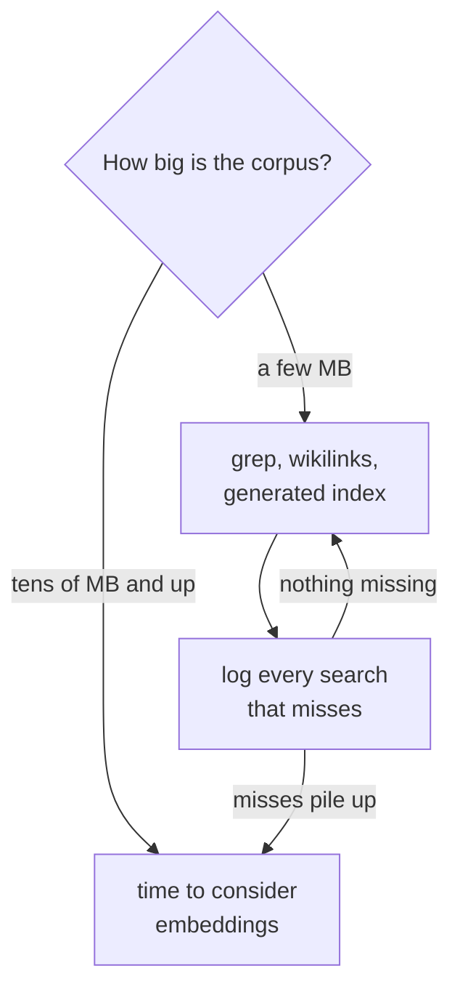
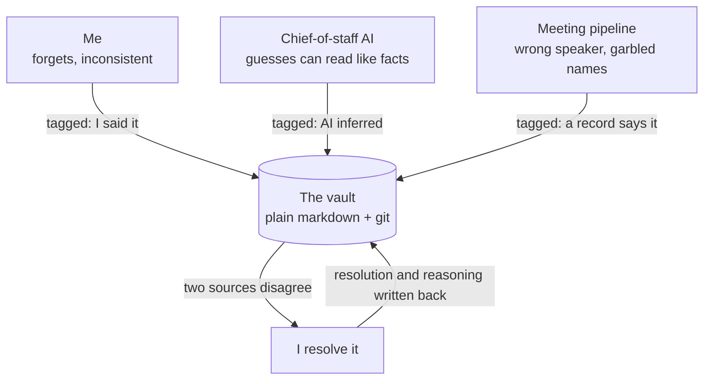

# Why a file vault, and not the obvious alternatives

People ask why this isn't built on a vector database, or in Obsidian, or with one of the agent memory frameworks. Fair question. Here's the reasoning, including where I think it stops being true.

## Retrieval was never the problem

The whole vault is about 1MB of markdown. Grep finds anything in it instantly, for almost no cost. Embeddings and vector search solve a problem I don't have yet, and they add a failure mode I'd rather avoid: a similarity search returns chunks stripped of their context, and I can't see why it picked them.

At my size, an AI that can search, open files and follow links beats a similarity score. I'll revisit if the vault passes roughly 20MB, or if I start seeing searches genuinely miss things. I keep a log for exactly that, so the decision comes from data instead of nerves.

## The actual problem is corruption

I make real decisions off what's in these files. Money, relationships, commitments. So the failure that costs me isn't "the AI couldn't find the note". It's:

- the AI writes its own guess in a way that reads like something I said
- a meeting note pins a quote on the wrong person, and that becomes the record
- two files disagree and the AI quietly picks one
- one AI acts on another AI's claim that was wrong

Note apps don't address any of that. Neither does retrieval. That's why the rules exist.

## Three writers, three failure modes

Most systems assume one writer. This one has three, and they break differently.

| Writer | Fails by |
|---|---|
| Me | forgetting, being inconsistent, being too busy to write it down |
| The chief-of-staff AI | confident guesses presented as fact, settling disagreements quietly |
| The meeting pipeline | wrong speaker, garbled names, format drift |

A note app assumes only the first. Agent memory systems assume only the second, and let it audit itself. The interesting problems all start when two writers disagree, and my position is that disagreement is data. A machine never settles it quietly.

Everything each writer puts in carries a tag saying who it came from, and anything contradictory comes back to me:

The tag is the whole trick. Six weeks later I can still tell which parts I said and which parts a model filled in helpfully.

## How it compares

| What | Covers | Misses |
|---|---|---|
| Obsidian, Zettelkasten | linking, human notes | one writer, no provenance, no AI rules |
| Instruction files (`CLAUDE.md` and similar) | how the AI behaves this session | no memory model, no multi-writer rules |
| Agent memory banks, MemGPT | AI keeps context across sessions | the AI audits its own writes |
| Vector RAG | retrieval at scale | nothing about trust |

The gap I couldn't find covered anywhere: shared memory with several writers, human and AI, where the danger is corruption rather than forgetting. If something out there does cover it, tell me and I'll link it.

## What I left out on purpose

**No vector database.** See above.

**No direct channel between the two AIs.** They message each other through files, and I carry every one. Slower than an API call. That's the point: a person reads every cross-AI claim before it turns into action, and it has caught real errors, including one AI formally accusing the other of deleting something that was never deleted.

**Nothing gets promoted automatically.** Observations don't merge themselves, AI guesses don't become facts on a timer, pending items don't quietly become permanent. Every default falls toward "the vault doesn't know yet".
